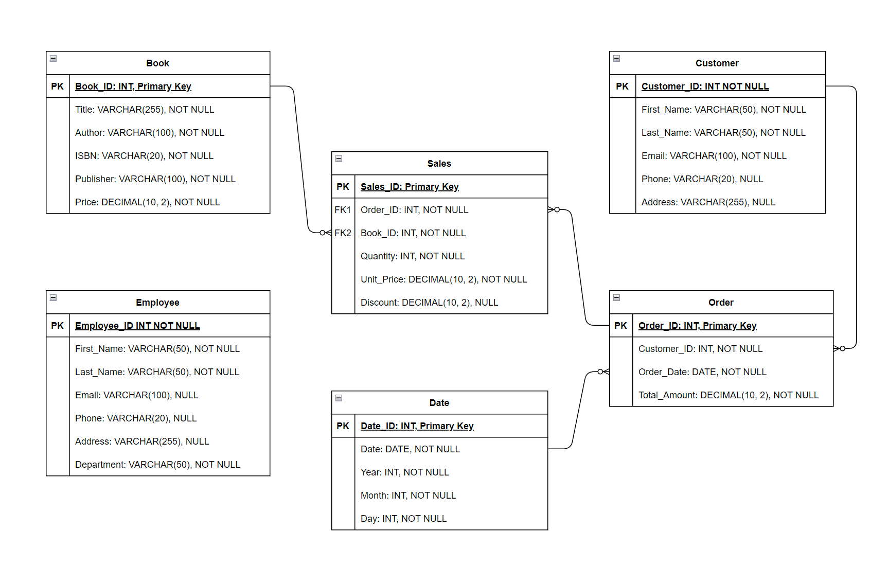
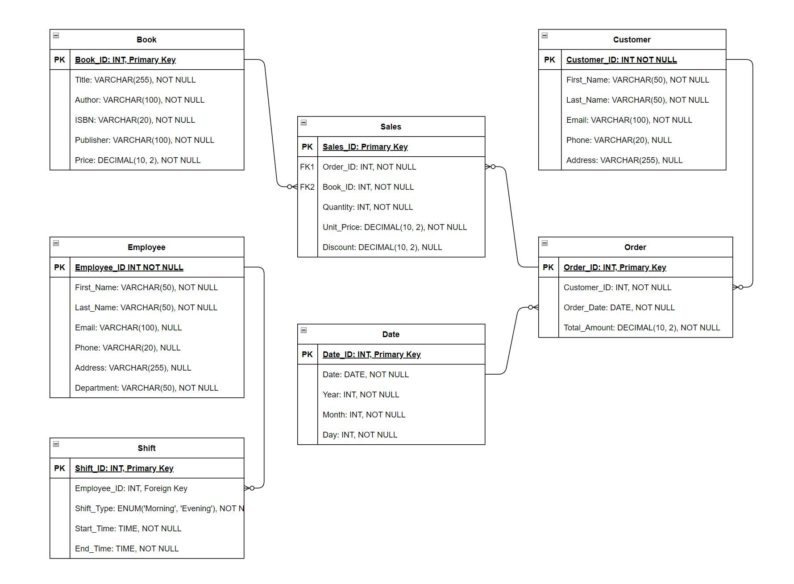

# Assignment 1: Design a Logical Model

## Question 1
Create a logical model for a small bookstore. 📚

At the minimum it should have employee, order, sales, customer, and book entities (tables). Determine sensible column and table design based on what you know about these concepts. Keep it simple, but work out sensible relationships to keep tables reasonably sized. Include a date table. There are several tools online you can use, I'd recommend [_Draw.io_](https://www.drawio.com/) or [_LucidChart_](https://www.lucidchart.com/pages/).



## Question 2
We want to create employee shifts, splitting up the day into morning and evening. Add this to the ERD.


## Question 3
The store wants to keep customer addresses. Propose two architectures for the CUSTOMER_ADDRESS table, one that will retain changes, and another that will overwrite. Which is type 1, which is type 2?

_Hint, search type 1 vs type 2 slowly changing dimensions._

Bonus: Are there privacy implications to this, why or why not?
```
Your answer...

Type 1:
In this approach, every time a customer's address changes, the old address is overwritten with the new one. This means that the database only retains the most recent address for each customer.

CREATE TABLE CUSTOMER_ADDRESS (
    Customer_ID INT PRIMARY KEY,
    Address VARCHAR(255) NOT NULL,
    City VARCHAR(100) NOT NULL,
    State VARCHAR(100) NOT NULL,
    Zip_Code VARCHAR(20) NOT NULL,
    Country VARCHAR(100) NOT NULL
);

Type 2:
In this approach, every time a customer's address changes, a new record is created, and the old record is marked as historical. This way, the database retains all previous addresses along with the current one.
CREATE TABLE CUSTOMER_ADDRESS (
    Customer_Address_ID INT PRIMARY KEY,
    Customer_ID INT NOT NULL,
    Address VARCHAR(255) NOT NULL,
    City VARCHAR(100) NOT NULL,
    State VARCHAR(100) NOT NULL,
    Zip_Code VARCHAR(20) NOT NULL,
    Country VARCHAR(100) NOT NULL,
    Start_Date DATE NOT NULL,
    End_Date DATE NULL
);

Privacy Implications: Type 1 is less sensitive because only the current address is stored. The historical addresses are not saved. If there were any breaches in the past, the old data is not valid.

```


## Question 4
Review the AdventureWorks Schema [here](https://i.stack.imgur.com/LMu4W.gif)

Highlight at least two differences between it and your ERD. Would you change anything in yours?
```
Your answer...

1 - Address
I save Address as string in Customer and Employee table.  The example keeps Address in a separated table, and then connect other tables via the Address ID.  

2 - Sales Order
I keep orders in just Order table. The example saves orders in Header and Detail table. Both have a one-to-many relationship.

The two approaches are mush better than mine. They have better relationship logically and structurally. I would change mine.

```

# Criteria

[Assignment Rubric](./assignment_rubric.md)

# Submission Information

🚨 **Please review our [Assignment Submission Guide](https://github.com/UofT-DSI/onboarding/blob/main/onboarding_documents/submissions.md)** 🚨 for detailed instructions on how to format, branch, and submit your work. Following these guidelines is crucial for your submissions to be evaluated correctly.

### Submission Parameters:
* Submission Due Date: `June 1, 2024`
* The branch name for your repo should be: `model-design`
* What to submit for this assignment:
    * This markdown (design_a_logical_model.md) should be populated.
    * Two Entity-Relationship Diagrams (preferably in a pdf, jpeg, png format).
* What the pull request link should look like for this assignment: `https://github.com/<your_github_username>/sql/pull/<pr_id>`
    * Open a private window in your browser. Copy and paste the link to your pull request into the address bar. Make sure you can see your pull request properly. This helps the technical facilitator and learning support staff review your submission easily.

Checklist:
- [ ] Create a branch called `model-design`.
- [ ] Ensure that the repository is public.
- [ ] Review [the PR description guidelines](https://github.com/UofT-DSI/onboarding/blob/main/onboarding_documents/submissions.md#guidelines-for-pull-request-descriptions) and adhere to them.
- [ ] Verify that the link is accessible in a private browser window.

If you encounter any difficulties or have questions, please don't hesitate to reach out to our team via our Slack at `#cohort-3-help`. Our Technical Facilitators and Learning Support staff are here to help you navigate any challenges.
